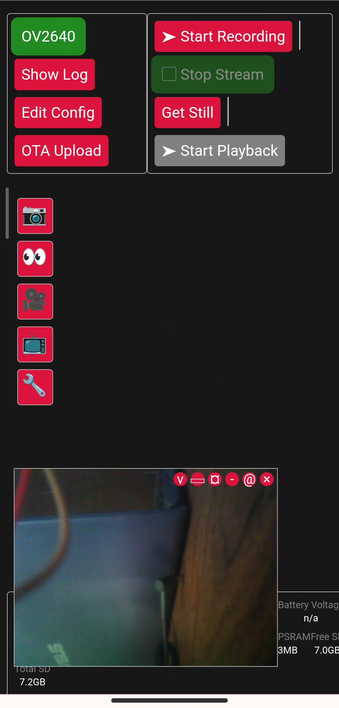
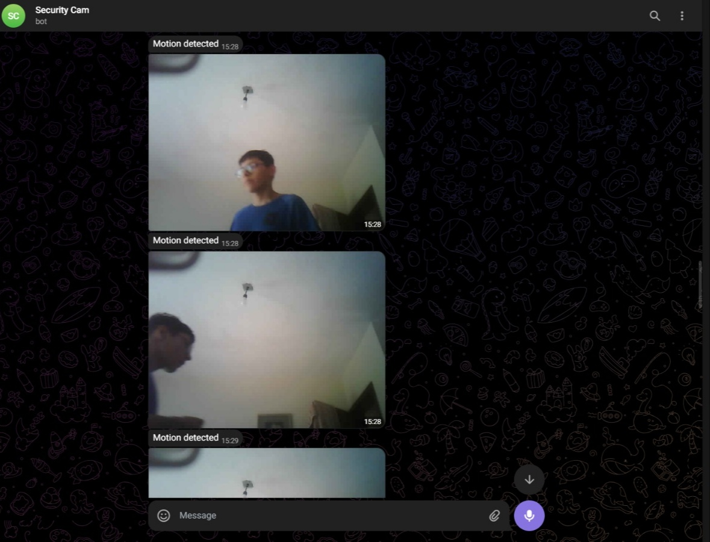
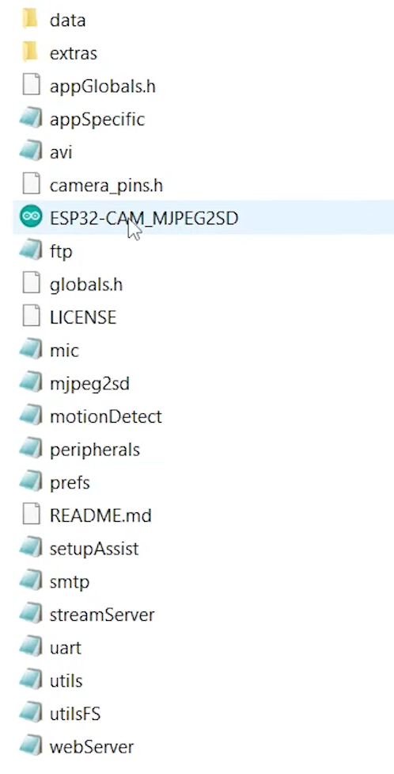
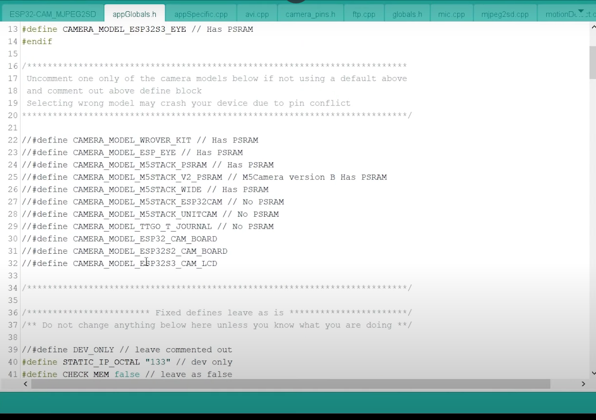
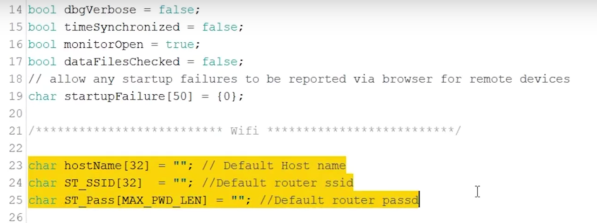

# Sistema-de-videovigilancia-incorporando-ESP32CAM

Sistema de videovigilancia con ESP32CAM en Arduino IDE, para este caso usaremos dos ESP32CAM (se pueden implementar más), una de ellas la cual es para detección de movimiento y la otra como webserver.

*************************************************************************************
# Objetivo
Crear un sistema de videovigilancia que permita el acceso en tiempo real para monitorear lo que ocurre en un lugar específico. El sistema enviará notificaciones a través de Telegram cuando se detecte la entrada de una persona en una habitación. Al detectar **movimiento**, el sistema notificará de inmediato y grabará todas las acciones y movimientos realizados.
*************************************************************************************************

# Componentes
* ESP32 CAM OV2640
* FTDI TTL USB Serial Converter
* Cables Macho-Hembra
* Cable USB to Mini USB
* Tarjeta MicroSD 4 GB

******************************************************************************************
# Librerias
Para las dos ESP32CAM necesitaras ArduinoJSON:

https://raw.githubusercontent.com/espressif/arduino-esp32/gh-pages/package_esp32_dev_index.json

Esta liga la pegaras en el apartado  `File` > `Preferences` > `Additional Boards Manager URLs`;
Con esta liga podras acceder a las librerias necesarias para la utilización de ESP32CAM

ESP32CAM detección de movimiento:
* **EloquentSurveillance** by Simone Salerno
* **UniversalTelegramBot** by Brian Lough

**********************************************************************************

# Motion Detection CAM

Para acceder al codigo deberas ir al apartado `File` > `Examples` > `EloquentSurveillance` > `MotionDetectionTelegramExample`;
Dentro del codigo modificaras con tu propia información:
* WIFI_SSID
* WIFI_PASS
* BOT_TOKEN
* CHAT_ID
  
Dentro del codigo en la linea 30 cambiar **camera.mswide();** por **camera.aithinker();** ya que el modelo de nuestra camara es AI Thinker ESP32-CAM.
Para crear un bot en telegram usa BotFather (al crear un Bot te dara tu Bot token), y para obtener tu chat ID usa IDBot. 
Adjuntamos el siguiente link con un tutorial que detalla los pasos para la creación de un bot de Telegram. 

https://www.lead2team.com/academy/telegram-business/bot-de-telegram/
***********************************************************************************

# Web Server CAM
Para el correcto funcionamiento del sistema de videovigilancia será necesario programar y posteriormente confirgurar el dispositivo con el código correspondiente.

*ESPCAM WEBSERVER*
* **ESP32-CAM_MJPEG2SD** by s60sc.

Lo puedes encontrar en el siguiente enlace:

[ESP32-CAM_MJPEG2SD](https://github.com/s60sc/ESP32-CAM_MJPEG2SD)

**Instalación y configuración**

Descargue los archivos de github en la carpeta de bocetos de Arduino IDE.

Dentro del código selecciona la placa ESP-CAM requerida usando `CAMERA_MODEL_` en `appGlobals.h` a menos que uses la predeterminada:
* Tarjeta ESP32 Cam - `CAMERA_MODEL_AI_THINKER`.

  

De la misma manera, dentro de `utils.cpp` modificaremos el código con la información de nuestra red, esto es:
* WIFI_SSID
* WIFI_PASS

 

Después de programar y configurar la ESP32CAM con los pasos anteriores es necesario insertar una tarjeta memoria micro SD (preferentemente de 8 GB de capacidad o superior) configurada de la siguiente manera:

* Del código anteriormente descargado, localizar la carpeta `data` y copiarla a la tarjeta de memoria micro SD.

## Función principal

Una grabación se genera cuando la propia cámara detecta movimiento, o manteniendo alto un pin determinado (que se mantiene bajo por pulldown interno cuando se libera), por ejemplo utilizando un sensor de movimiento activo alto como PIR.
Además, se puede solicitar una grabación manualmente mediante el botón **Iniciar grabación** de la página web.

Para reproducir una grabación, seleccione el archivo mediante el botón de la barra lateral **Reproducción y transferencia de archivos** para seleccionar la carpeta del día y, a continuación, el archivo AVI deseado.
Una vez seleccionado el archivo AVI, pulse el botón **Iniciar reproducción** para reproducir la grabación. 
El botón **Iniciar transmisión** muestra una transmisión sólo de vídeo en directo desde la cámara. 

### Página web de configuración

Acceso a más detalles de configuración a través de la pestaña **Editar Config**, que muestra más botones:

**WiFi**:
Ajustes adicionales de WiFi y servidor web.

**Movimiento**: 
La propia cámara puede generar una grabación AVI detectando movimiento mediante el archivo `motionDetect.cpp`. 

**Periféricos** Ej:
* Seleccionar si se va a utilizar un sensor PIR o radar (que también se puede utilizar en paralelo con la detección de movimiento por cámara).
* Encendido automático de la lámpara para la detección nocturna PIR.
* Control de pan / tilt para la cámara.
* Conectar un micrófono.
* Monitorizar el voltaje de la batería en el pin ADC.
* Despertar en LDR después de sueño profundo en la noche.

  ### Hub de cámaras

Esta pestaña permite acceder a las interfaces web de otros dispositivos de cámara ESP32-CAM_MJPEG2SD. Para mostrar esta pestaña, en la página **Edit Config** en **Other**, seleccione `Show Camera Hub tab`.  

En la pestaña, introduce la dirección IP de otra cámara y pulsa el botón **Add IP**, aparecerá una pantalla mostrando una imagen de la cámara con su dirección IP superpuesta. Repita el procedimiento para cada cámara que desee supervisar. Pulse sobre una imagen para abrir la página web de esa cámara.  

Pulse el icono **X** en la imagen para eliminar esa dirección IP. Pulse el botón **Borrar todo** para eliminar todas las direcciones IP. Pulse el botón **Refrescar** para actualizar cada pantalla con la última imagen de esa cámara.  

Las direcciones IP se almacenan en la memoria local del navegador, no en la aplicación.

***************************************************************************************************************************

Este proyecto fue realizado en el marco del curso IoT Essentials Developer impartido por [Codigo IoT](https://www.codigoiot.com/) y organizado por la [Asociación Mexicana del Internet de las Cosas](https://www.asociacioniot.org/).

